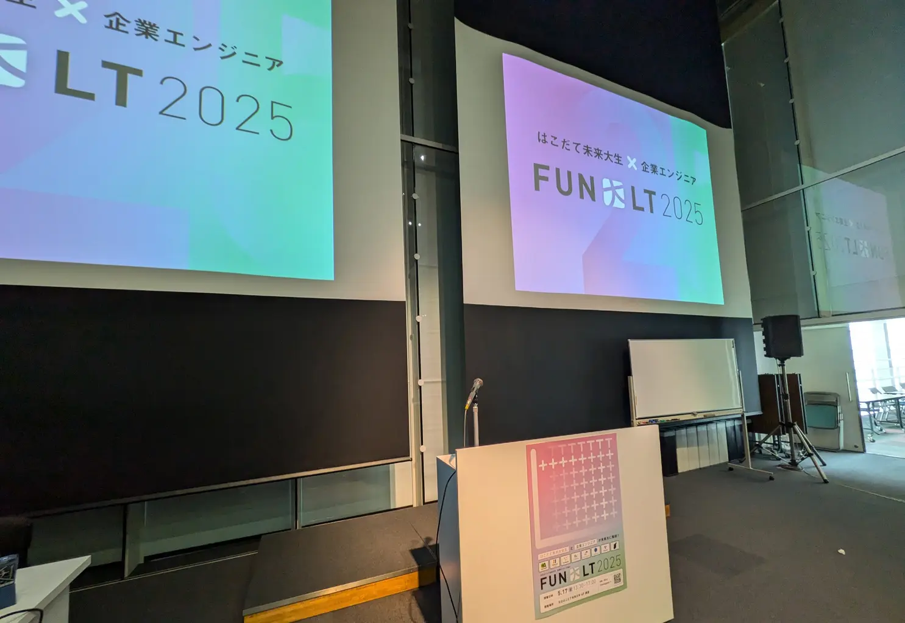

# はじめに

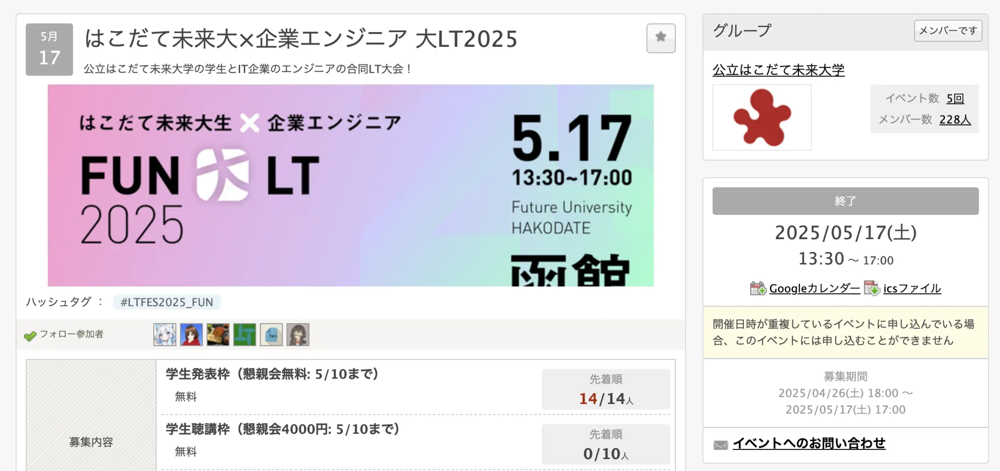

2025年5月17日、「[はこだて未来大×企業エンジニア 大LT2025](https://fun.connpass.com/event/353080/)」を開催しました。  

今回のLT大会では以下の企業さんをお招きしました (敬称略、50音順):
- 株式会社サイバーエージェント
- 株式会社Helpfeel
- 株式会社ゆめみ
- サイボウズ株式会社
- さくらインターネット株式会社
- GMOペパボ株式会社
- フラー株式会社
- フェンリル株式会社

函館にお越しいただいた協賛企業の方々、また参加いただいた未来大の学生の皆様、本当にありがとうございました！大変盛況なイベントとなりました。

当日の様子は以下のリンクからご覧いただけます:

- Xでのハッシュタグ「[#LTFES2025_FUN](https://x.com/search?q=%23LTFES2025_FUN)」
- [Google Photos](https://photos.google.com/share/AF1QipNTF05FcRInUYks8P6och1_zapU556BWpnbMnZ0CZjwZZQcQwp7LBIU1Plnwr7Jsg?key=aXlWd0FnSFVqOUZkUy11V09pMUt1UUIyaGVtN293)
- 振り返り記事 (敬称略、順不同):
  - [カメラマンとして参加したLT大会の裏側 by issy](https://issy-088.hatenablog.com/entry/2025/05/20/220108)
  - [はこだて未来大×企業エンジニア 大LT2025 に参加した話 by uiro](https://uiro.dev/pages/ltfes2025fun)
  - [はこだて未来大×企業エンジニア 大LT2025 で、sussanが企業エンジニア枠で発表してきました by sussan (株式会社Helpfeel)](https://zenn.dev/helpfeel/articles/046b668211b624)

私は運営代表として、イベントの企画進行を担当しました。
イベントの内容や盛り上がりの様子は上記の方々の記事に譲り、今回は運営視点での振り返りを行います。

# 経緯

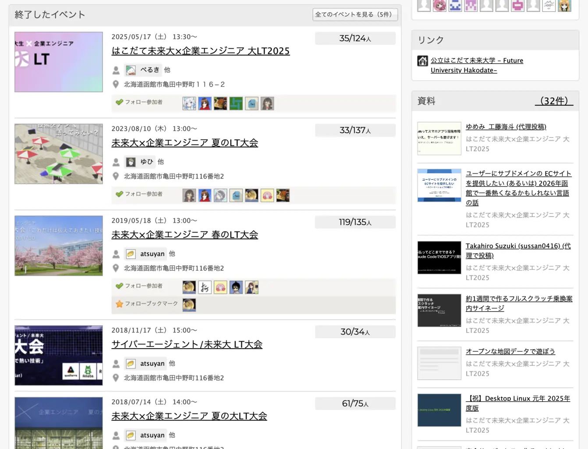

はこだて未来大学では2018年より、企業エンジニアも交えたLTイベントが恒例として開催されています。 

新型コロナウイルスの影響により、一度流れが途絶えてしまいましたが、  
その後2023年度には、今回の運営メンバーでもあるゆひさんの尽力により、開催が実現しました。

今年もその流れを引き継ごうという形で、開催を決めました。  
ちょうど2024年10月には、YAPC::Hakodateが未来大で開催されることもあり、新たな繋がりを作るチャンスにできないかという思いもありました。実際、YAPC期間中に沢山の企業に本イベントをPRし、これまでになかった新たな協賛も実現しました。

# 開催までの流れ

**2024**
- 10/3: 運営メンバーやスケジュールの決定
- 12/19: 予算見積もり・協賛企業との手続き開始

**2025**
- 1/30: 企画書・connpass・ポスター等素材の要件定義の整備
  - 企画書: [Google Docs](https://docs.google.com/document/d/1eMNlV0PxEAZaZAKbIzj7j3X-hw1Ynr-ryTDO0ni_vDo/edit?usp=sharing)
- 4/17: 予算の確定・広報の開始
- 5/12: 当日・事前準備の確認
- 5/16: 前日準備 (会場設営・物品の搬入)
- 5/17: イベント当日
- 5/21: 振り返り

今回はYAPCも踏まえ、約9ヶ月と長く緩やかな企画進行でした。

# 事前準備

## 運営体制

ぺるき・uiro・panya_bakery・issy・Tomisuke・kCat・Jugesuke・ゆひ (敬称略、順不同) の8人体制で進めました。  
事前準備から当日まで一貫して関わっていただきました。この場を借りて改めて感謝を申し上げます。

今回は準備の負担や、各人の時間の余裕の考慮といった背景の事情も踏まえ、運営体制が比較的大人数になりました。  
運営にあたっては次回への引き継ぎに使えるよう、運営用ドキュメントに意識的に知見を蓄積しました。今後、よりスムーズ・コンパクトな運営に繋がればと思います。

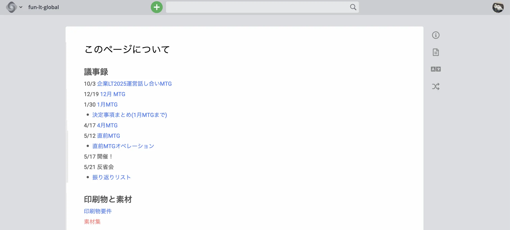
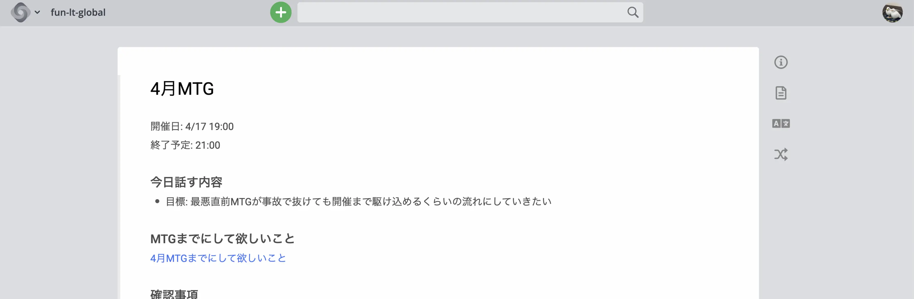
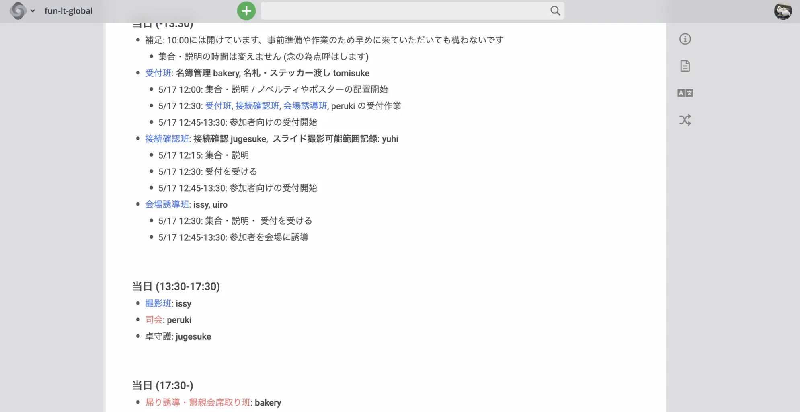

連絡手段としては次のようなツールを利用しました:
- **Cosense**: 運営用ドキュメント
  - アジェンダ兼議事録・TODO・当日の動き・知見のアーカイブなど...  
  運営に関する情報の集約と共有に利用しました
  - アジェンダに当日出た意見などをそのまま書き込む形で議事録を作成しました
- **Discord**: 運営メンバー間の連絡・MTGの開催
- **Slack**: 企業の方々との連絡 (請求書や荷物のやり取りなど)
  - 今回は、企業の方々との個別連絡も複数の運営メンバーで分担して行いました
  - 重要な連絡の内容についてはテンプレートを用意し、各企業の方々の事情などに応じて変更してもらうことで、メンバーを増やすことによる負担が少なくなるよう配慮しました

## 企業誘致

企業誘致の際には、YAPC::Hakodateでお話しした企業の方々に直接お声がけしたほか、過去に別の機会でお声をかけていただいていた企業の方々に、逆にお願いする形で進めました。この時点で、7社の企業にご協力いただけることが決まりました。

一方で、この流れは少々閉鎖的だったかと反省しています。一部の企業の方には「タイミングを逃してしまった」と誤解させてしまったこともあり (最終的にはこちらからもぜひとお呼びしました) 、公募のような形も兼ねて検討すれば良かったと思います。  

企業誘致にあたってはゆひさんに引き継ぎや連絡方法などの知見を共有していただいた他、企業とのやり取りは運営メンバーのほぼ全員で分担して行いました。panya_bakeryさんやissyさんにはYAPC::Hakodateで積極的に企業の方々にお声がけいただきました。

## 素材制作

ポスターからステッカー、オープニングスライドなどの素材は  
一貫してmkodさん (@Public_mkod) に制作していただきました。  
開催日はちょうど葉桜の時期であり、鮮やかな2色のデザインがとてもマッチしていました。

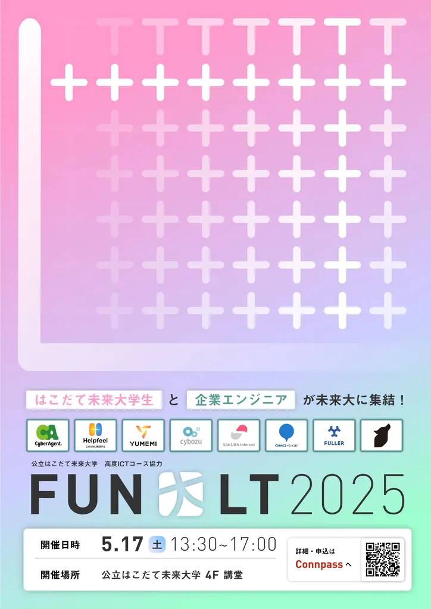
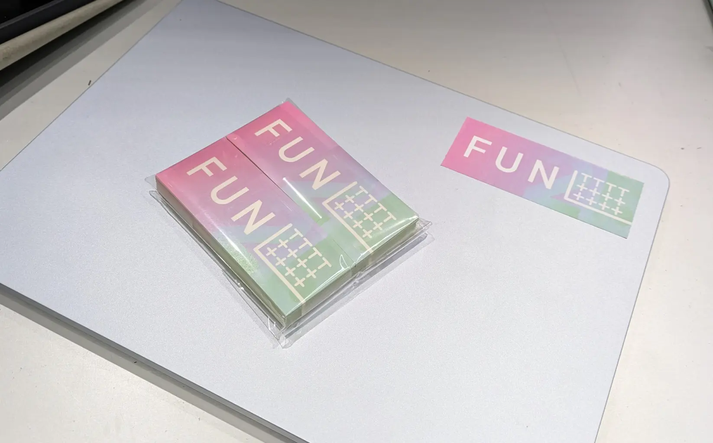
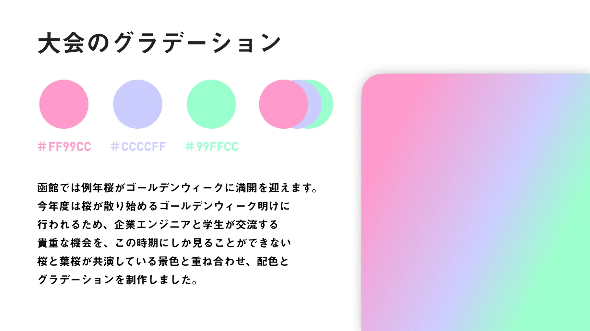
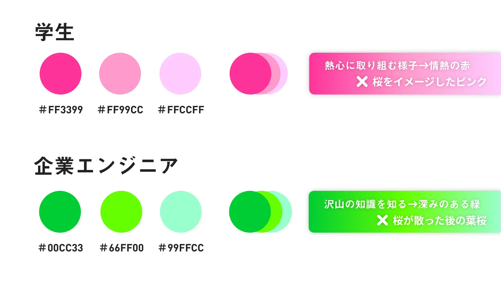

## 広報

<blockquote class="twitter-tweet">
<a href="https://t.co/NtSOGTQ7xu">https://t.co/NtSOGTQ7xu</a>  「はこだて未来大×企業エンジニア 大LT2025」connpassを公開しました！皆様是非お申し込みください。 ※ はこだて未来大の学生限定です。  よろしくお願いします！
&mdash; ぺるき (@PerukiFUN) <a href="https://twitter.com/PerukiFUN/status/1916054930214801826?ref_src=twsrc%5Etfw">April 26, 2025</a></blockquote> 

広報の主な取り組みとしては:
- SNS(X)での告知 
- 高度ICT演習での告知
- ポスターの掲示
- 学内メールでの告知

広報は特にKCatさんやTomisukeさんに協力してもらいながら進めました。

SNS(X)や高度ICT演習での告知は直接的な効果がありました。  
ポスター・学内メールについては、直接的に参加が増えたかは不透明であるものの、  
「企業が協賛するLTイベントがあるらしい」ということを広く知ってもらえたようで、間接的な効果が見られました。

ポスターはそのままチラシとして配布したり、イベント当日にも受付に掲示するなど、  
情報がコンパクトにまとまった素材として様々な場面で活用できたため、作成してよかったと振り返ります。

## タイムテーブル

](images/timetable.webp)

作成・管理・更新はuiroさんにお願いしました。  
企業エンジニアの方10分、学生5分と、これまでの開催と同様の時間配分で進行しました。

バスの時間との接続を考慮すると、30分程度時間が余ることが判明したため、
その時間の活用策として後述する自由交流時間を設けることを決定しました。

## アンケート作成

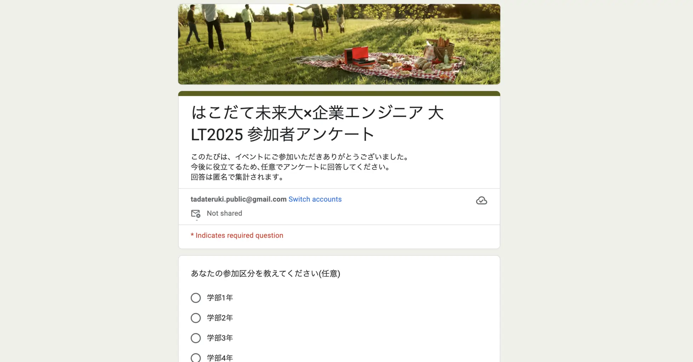

Mariners' Conferenceの知見なども踏まえ、Tomisukeさんにお願いしました。  
広報の効果やイベントの改善点の炙り出しなど、イベントの運営から学びを得る上で広く役立ちました。

# 当日の動き

## 受付

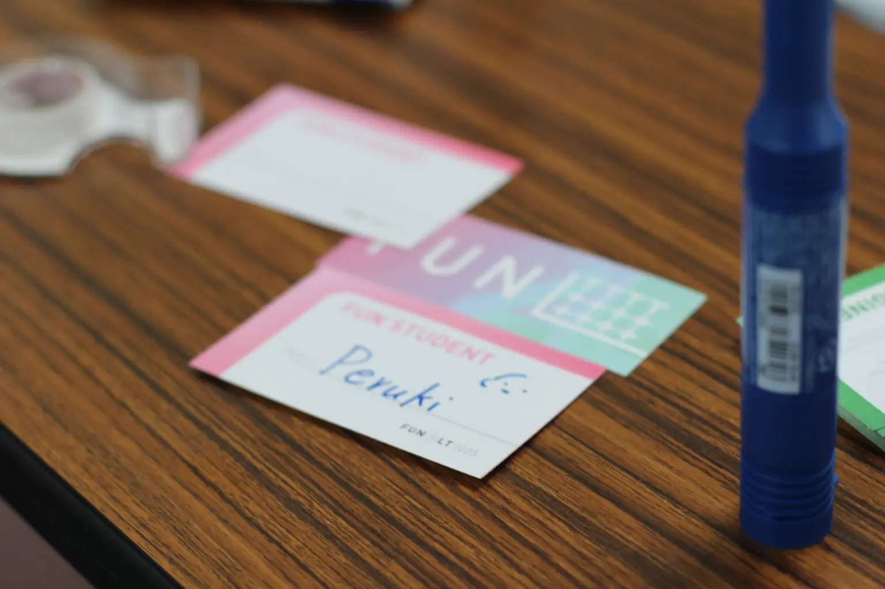
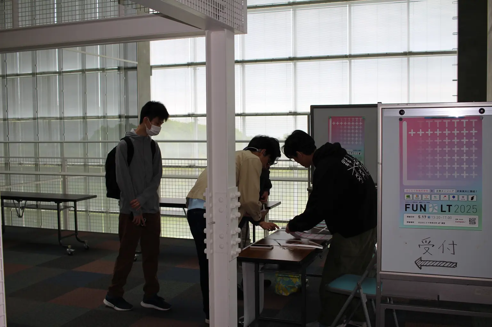

受付は複数人で分担しました。

- 名簿管理: panya_bakery (名簿作成: uiro)
- 名札の配布: Tomisuke
- 会場誘導: issy, uiro

受付は会場となる講堂前のスペースに設置しました。会場への動線上には企業のブースを設置し、受付してから会場に向かう流れでノベルティなどを受け取ったり、名刺交換を行えるようにしました。

講堂前のスペースは狭く、交流の場所をどう確保するかが悩みどころでした。今回はなんとか収まりましたが、今後は交流スペースを別教室などを借りて設けるなど、空間の余裕をもっと広げることを検討したいです。

## 撮影

撮影内容: [Google Photos](https://photos.google.com/share/AF1QipNTF05FcRInUYks8P6och1_zapU556BWpnbMnZ0CZjwZZQcQwp7LBIU1Plnwr7Jsg?key=aXlWd0FnSFVqOUZkUy11V09pMUt1UUIyaGVtN293)

撮影および公開 (撮影許可のチェック含む) はissyさんにお願いしました。開催前の準備中の写真もいくつかあるようです。

今回のイベント実施にあたっては、企画書の作成や広報などで使う写真素材の不足が悩みどころでした。参加者・運営メンバー双方による振り返りや、次の開催も含めた今後の広報に活用できるよう、参加者の方々から許可を得て撮影を行い公開しています。

## 進行

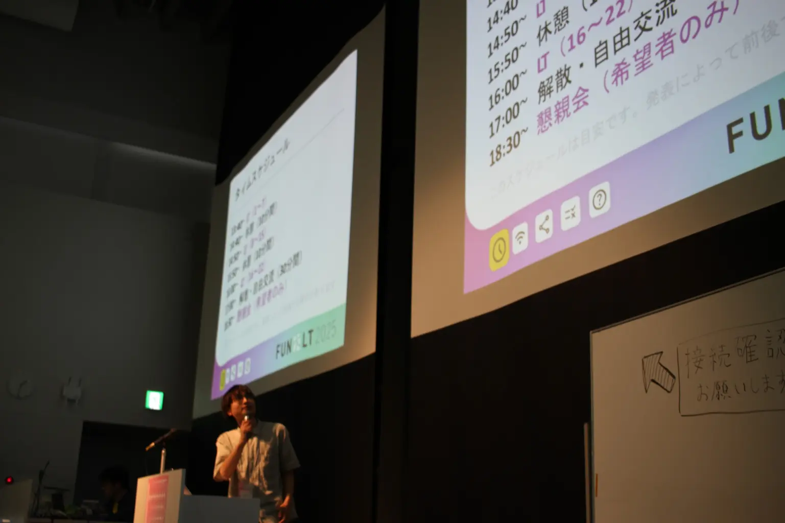

司会は私が担当しました。

卓の操作などはYAPC::Hakodateでも経験のあるjugesukeさんにお願いした他、接続確認の流れなどではゆひさんにも協力していただきました。

## 自由交流時間

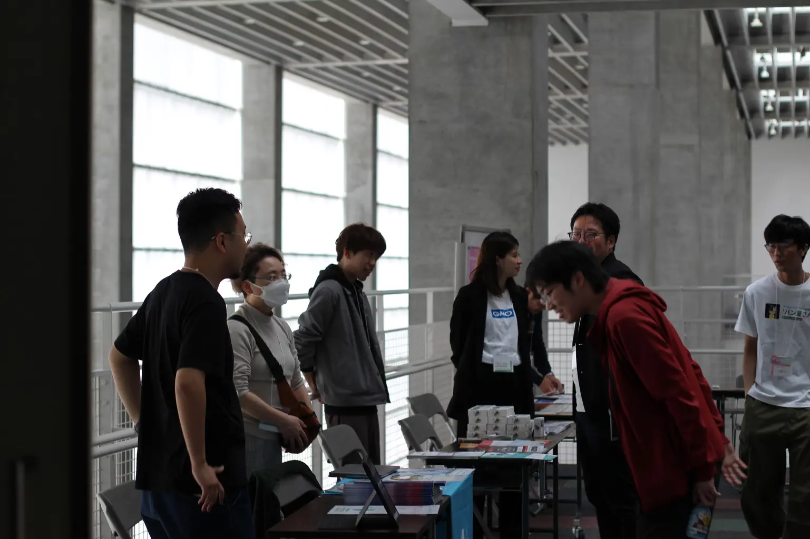

懇親会の参加者以外にも企業や学生同士の交流をしてもらえるよう、
イベント終了後に30分の自由交流時間を設けました。

各企業の方々に長机半分のスペースを提供し、
ノベルティや名刺交換など、自由に使えるブースとして活用していただきました。  
大変盛り上がり、企業の方々からも好評だったため、この点は開催前からもう少し強調しておけば良かったと思っています。

## 反省点

今回は目立った事故がなく、無事に終えることができましたが、改善すべき点はまだいくつか残っています。例えば: 

- 協賛規定の整備
  - 協賛金の取り扱い、運営の権利範囲など
- 開催時期
  - マリカンをはじめ4-5月に多くのイベントが偏ったため、7月ごろの開催も視野に入れていいかと思いました
- テーマの設定
  - 今回はなしとしましたが、登壇のハードルを下げるという意味でテーマを設けるのも良いかもしれません
- 参加者層の広がりの限界
  - 他イベントとの連携など、より広い層にアプローチする取り組みが必要と感じました

# おわりに

今回は未来大の貴重なイベントを引き継ぐことができ、その中でYAPCで得た知見や資源の活用できたことから、良い取り組みとなったと思います。何より当日は大変盛り上がり、開催して良かったと感じています。

これまでも何度か言及していますが、今回は引き継ぎを重視したイベント運営を行いました。
本イベントの開催にあたっても[2018年度のエントリ](https://natmark.hateblo.jp/entry/2018/07/18/111838)やゆひさんの知見が大変参考になりましたが、それでもゼロから整備しないといけない事項がいくつかありました。
今回は知見を積極的にアーカイブしたり、今後も自由に使える素材やテンプレートを揃えるなど取り組みました。

今回のイベントのように外部の方々と連携したものを含めた、多様なイベントが学生主体で行われる文化は未来大コミュニティの強い魅力であると思います。
次回も同様のイベントがあれば、ぜひ参加していただけると嬉しいです！

また、引き継いでいただける方がいると大変嬉しいです。2026年度の開催は実は難しいという話もあり、動いてくれる方を強く歓迎します。物事を興す流れや人との協働など、イベントの運営を通して学べることも多く、貴重な経験になるかと思います。もし興味があれば @PerukiFUN (X) までご連絡ください。

さらに今回、「うちの大学でもこのようなイベントがしたい！」と反応してくださった方もいました。  とても良い流れと思いますし、本記事の内容が参考になれば幸いです。

ありがとうございました！
